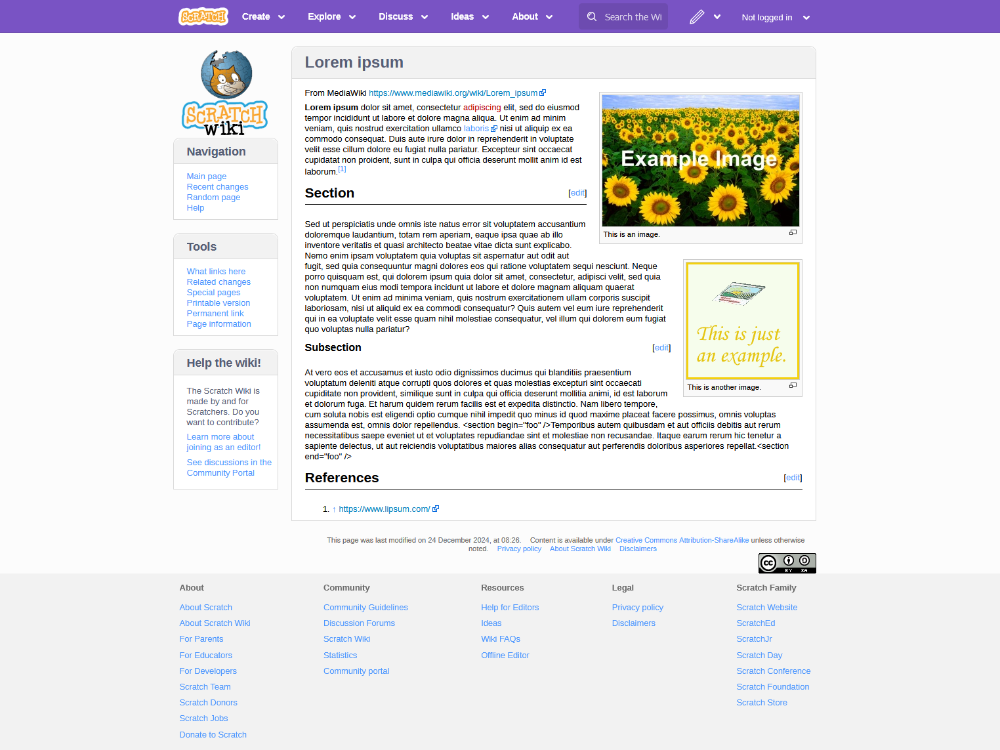

This is a backport the default skin for the various Scratch Wikis to older MediaWiki versions. It was only officially tested on MediaWiki 1.26.4 and PHP 5.3.8, but it should work on MediaWiki 1.25+ and PHP 5.3.3+.

<p align="center">
  
</p>

## Installation
1. Download the contents of this repository and save them into $wgScriptPath/skins/ScratchWikiSkin2 (a new directory)
2. Add the following line to LocalSettings.php:
```
wfLoadSkin( 'ScratchWikiSkin2' );
```
3. If desired, set $wgDefaultSkin as follows:
```
$wgDefaultSkin = 'scratchwikiskin2';
```
4. If desired, remove the IP options from the logged off menu as follows:
```
$wgShowIPinHeader = false;
```
5. To set the Wiki icon to the Scratch Wiki's, enable file uploads:
```
$wgEnableUploads = true;
$wgHashedUploadDirectory = false;
```
- Then, upload [this image](https://en.scratch-wiki.info/wiki/File:Wiki.png) to your wiki.
- Finally, set $wgLogo as follows:
```
$wgLogo = "$wgResourceBasePath/images/wiki.png";
```